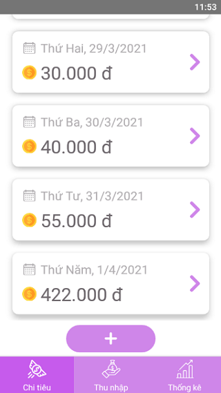

# Phần mêm Quản lý chi tiêu
Đây là phần mềm ghi lại những khoản chi tiêu và thu nhập hằng ngày. Sử dụng AsyncStogare để lưu trữ cục bộ trên điện thoại.

## Màn hình hiển thị danh sách các khoản chi tiêu hằng ngày

## Màn hình hiển thị chi tiết các khoản chi trong 1 ngày

## Màn hình thống kê

## Form để thêm khoản chi tiêu/thu nhập

